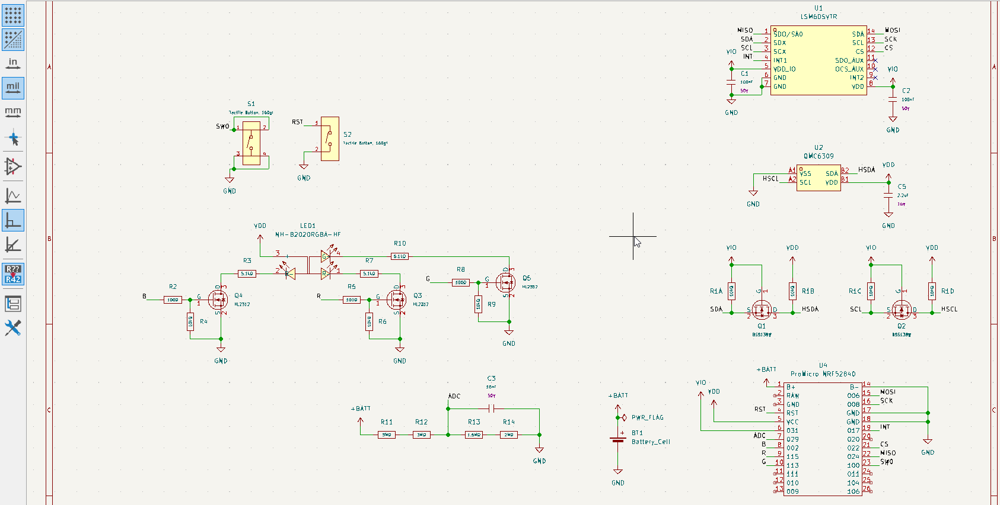
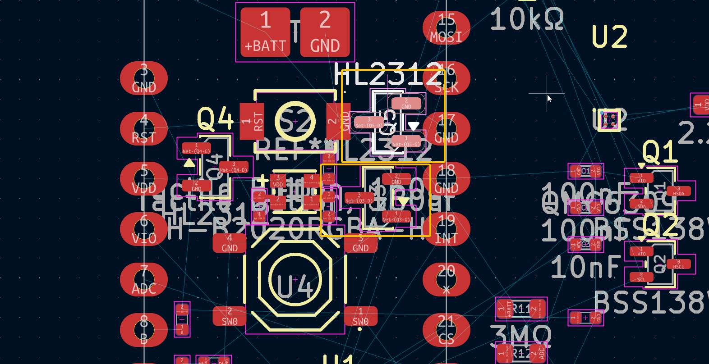
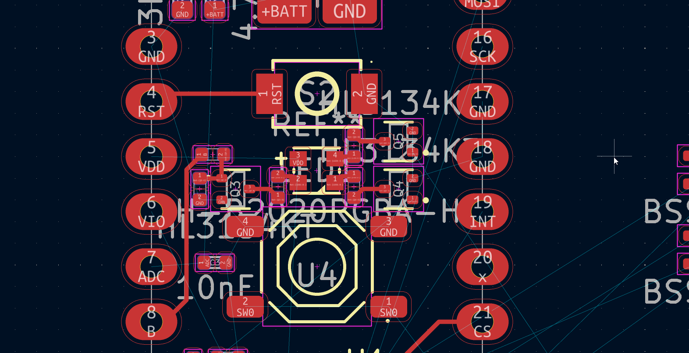
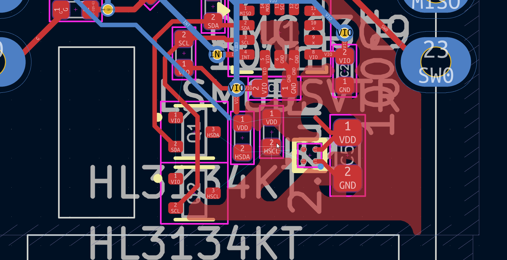
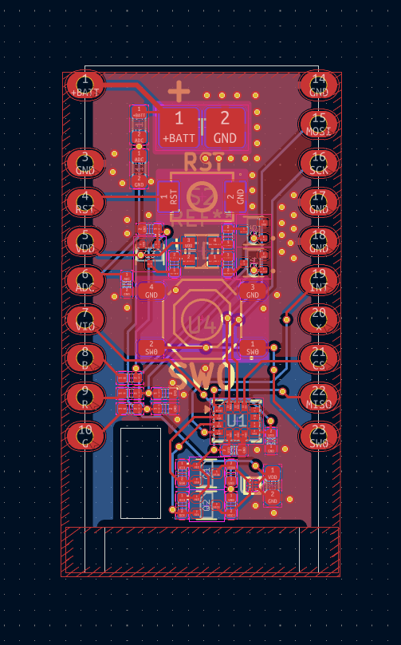

# 05-01-2026 - Project kickoff and goals
I started this project as a modification of the existing Chrysalis board, which is a carrier board for the NRF52840-based Pro Micro which adds an IMU, magnetometer, and buttons. However, the magnetometer used (QMC6309) only works on 3V3 (which is fine since the Pro Micro has an external 3V3 regulator on VCC instead of the actual NRF52840 VCC). However, its logic is also at 3V3, meaning that the NRF52840 had to run at 3V3.

I wanted to make something compatible with 1V8 logic, which is supposedly more power efficient. So, I wanted to add level shifting the magnetometer I2C and use mosfets to control each channel of the RGB LED. I also decided to add a voltage divider battery monitor to a spare ADC pin. Moreover, I also wanted a cutout on the board to access the SWD pads of the Pro Micro. I used reference schematics from the Chrysalis to get started, and spent some time selecting mosfets for the led control that were in JLC's basic library. I also used the Pro Micro and Battery pads footprint from the Chrysalis to get started.

`Total time spent: 3 hours`

# 05-04-2026 - Routing start and MOSFET swap
I began routing the board, starting with components that needed to be fixed. I wanted to maintain the same essential layout of the Chrysalis since there were already a couple compatible enclosures. However, I quickly realized the SOT-23 mosfets I selected for the LED control were too large for the board, and would require a lot of extra space. I decided to use the smaller SOT-523 mosfets (which I didn't know existed, just thought the smallest was SOT-323). I also decided to use the same mosfets (HL3134KT) for level shifting since they seemed better spec-wise than the BSS138. 

This was a lot better:

`Total time spent: 3 hours`

# 05-05-2026 - Ground plane routing grind
I continued routing the board, which was pretty painful due to the small size and large space b/t components. I had to do a lot of rerouting to avoid making half the board an island for the ground plane. 
ex:

Getting the plane to span the board was quite challenging in general. I re-routed the bottom half twice to make sure everything could be connected and the ground plane could still span. It also took several iterations of moving components around for more compact routing. Although there's still a few islands, it is not as bad as it was. I eventually ended up finishing the routing.

`Total time spent: 4 hours`

# 05-06-2026 - Silkscreen and schematic cleanup
I did a few silkscreen finishing touches in terms of the PCB and cleaned up the schematic.
PCB:

SCH:

3D:

`Total time spent: 0.5 hours`