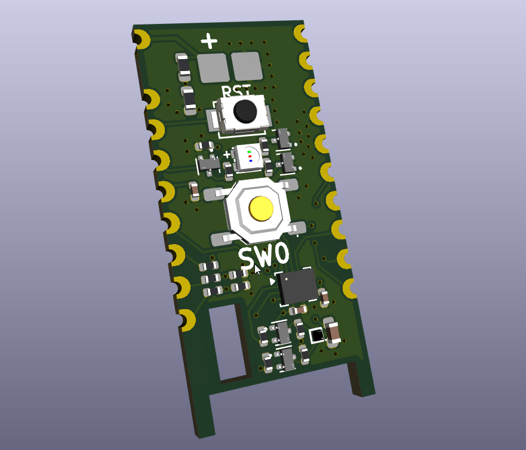
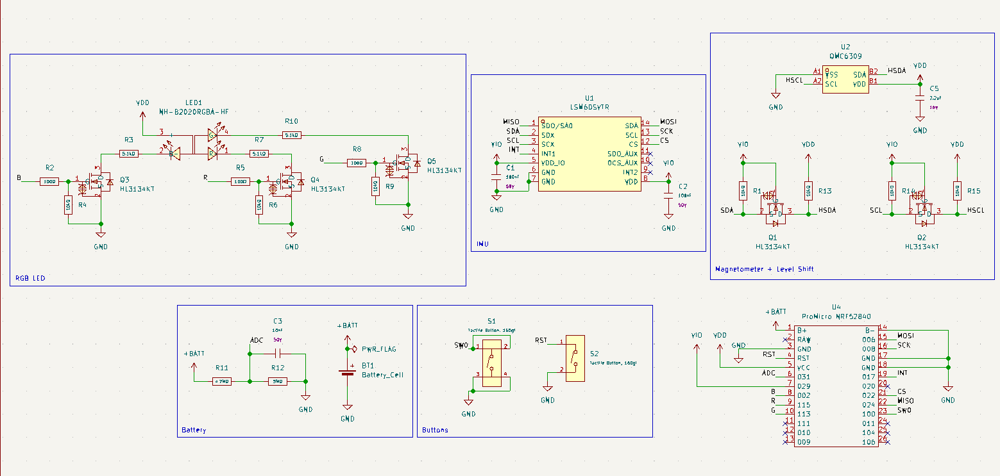

# promicro_smol

`promicro_smol` is a compact shield PCB for the nRF52840 Supermini/Pro Micro used in DIY SlimeVR trackers. It has an IMU, magnetometer, two buttons, RGB LED, battery pads and voltage reading functionality. It is designed to be compatible with existing Chrysalis enclosures (not yet verified).

## Why I Made This

This project started as a modification of Chrysalis to support operation at 1.8V logic and to add a few features. The main changes were to make the magnetometer support 1.8V logic, switch to a MOSFET-controlled RGB LED, add a battery voltage divider for better capacity measurement, and to make sure SWD pads are accessible through a board cutout. I made these changes ensuring the board is optimized for JLCPCB economic assembly.

## Pictures

### Schematic

## Credits and Attribution
This work is derived from the [kounocom/Chrysalis](https://github.com/kounocom/Chrysalis) hardware project.

Files from `Chrysalis-Footprints.pretty` are sourced from the Chrysalis project with and without modifications.

The upstream project is provided under CERN-OHL-S-2.0, and this repository includes the applicable license text in `LICENSE.md`.

## Bill of Materials

| Item | Value / Part | Quantity |
| --- | --- | ---: |
| MCU module | ProMicro nRF52840 | 1 |
| IMU | LSM6DSVTR | 1 |
| Magnetometer | QMC6309 | 1 |
| N-FETs | HL3134KT | 5 |
| RGB LED | NH-B2020RGBA-HF | 1 |
| Push buttons | Tactile button | 2 |
| Resistors | 100R, 5.1k, 10k, 3M, 4.7M | 12 |
| Capacitors | 100nF, 10nF, 2.2uF | 4 |
